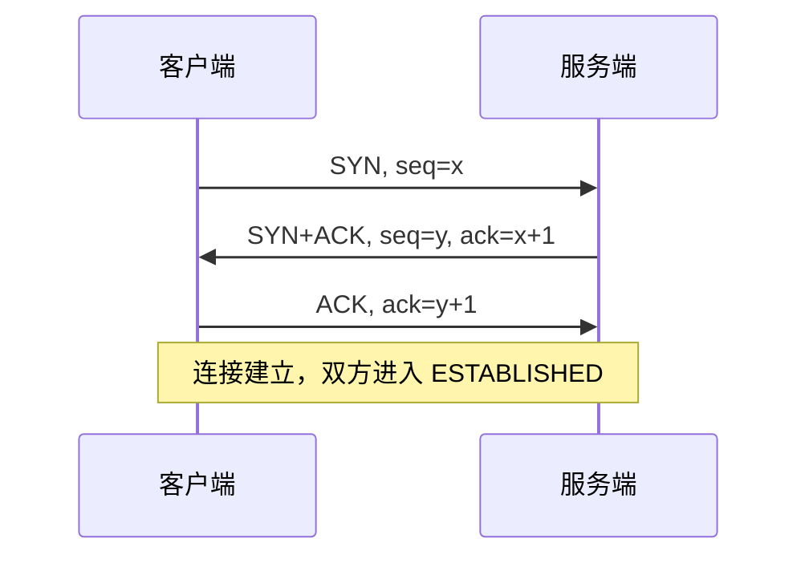
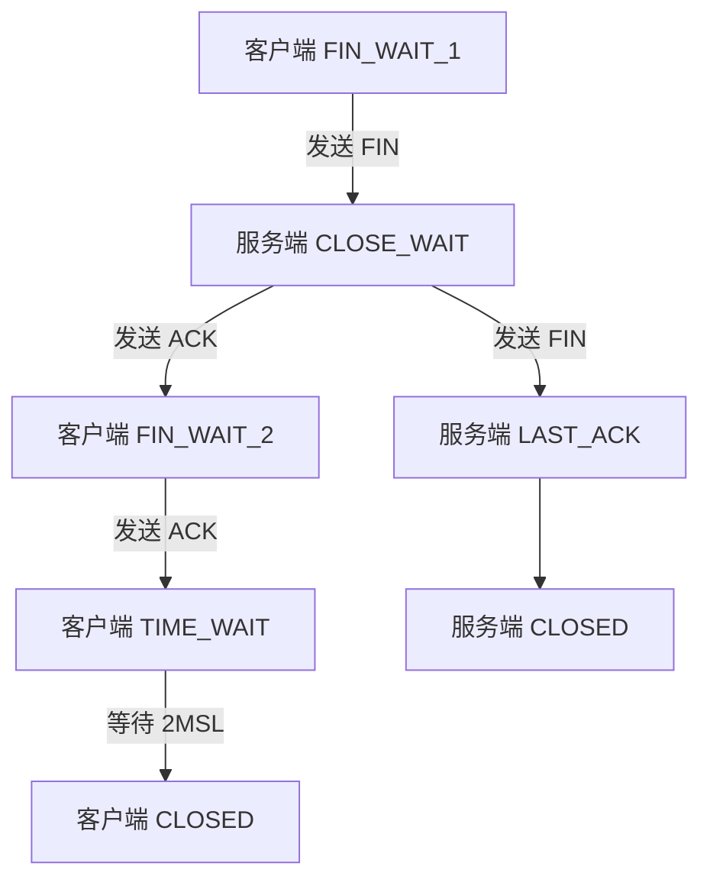

# TCP 三次握手与四次挥手

TCP 是面向连接的可靠传输协议，连接的建立与释放是理解其可靠性的起点。本文从状态机与序号机制出发，梳理两次过程，并给出常见踩坑点。

## 为什么需要三次握手

核心目的是**双方都确认对方的收发能力正常**，并同步初始序号（ISN）。

一次握手只能让服务端确认"客户端能发"；两次握手无法让客户端确认"服务端能发"，且服务端会在收到延迟的旧连接请求时错误地建立连接。



### 状态迁移

| 阶段 | 客户端状态 | 服务端状态 |
| --- | --- | --- |
| 发送 SYN | SYN_SENT | LISTEN |
| 收到 SYN+ACK | ESTABLISHED | SYN_RCVD |
| 收到 ACK | ESTABLISHED | ESTABLISHED |

## 为什么挥手需要四次

TCP 是全双工的，每个方向需要独立关闭，因此 FIN 与 ACK 通常不能合并。



### TIME_WAIT 的两个作用

- 保证最后一个 ACK 能到达对端，若丢失可重传
- 让本次连接的残留报文在网络中自然消亡，避免污染新连接

::: tip 等待时长
TIME_WAIT 持续 `2 * MSL`。Linux 上 MSL 默认为 30 秒，因此实际等待约 60 秒，可通过 `net.ipv4.tcp_fin_timeout` 调整。
:::

## 初始序号的选择

ISN 不能固定，否则容易被推测并注入报文。RFC 793 规定 ISN 与时间相关，现代实现使用更复杂的算法：

$$
ISN = M + F(localhost, localport, remotehost, remoteport)
$$

其中 $M$ 是 4 微秒计时器，$F$ 是伪随机函数。这样既保证递增，又不可预测。

## 用 tcpdump 观察握手

```bash
# 抓取与 93.184.216.34 的 80 端口交互，只保留握手相关标志位
sudo tcpdump -i eth0 -n -S 'tcp port 80 and (tcp[tcpflags] & (tcp-syn|tcp-fin|tcp-ack) != 0)'

# 输出示例（-S 显示绝对序号，便于核对 ack 关系）
# IP 10.0.0.2.51234 > 93.184.216.34.80: Flags [S], seq 1001, win 64240
# IP 93.184.216.34.80 > 10.0.0.2.51234: Flags [S.], seq 2001, ack 1002
# IP 10.0.0.2.51234 > 93.184.216.34.80: Flags [.], ack 2002
```

::: warning 常见误区
抓包看到的 `seq` 是相对序号（默认 `-S` 未开启时），并不等于真实 ISN。核对握手逻辑时应加 `-S` 使用绝对序号。
:::

::: info
本文只覆盖连接建立与释放的状态机。拥塞控制、滑动窗口与重传策略另文展开。
:::

## 更新日志

| 日期 | 说明 |
| --- | --- |
| 2026-10-07 | 初稿：三次握手、四次挥手、TIME_WAIT 与 ISN 选择 |
