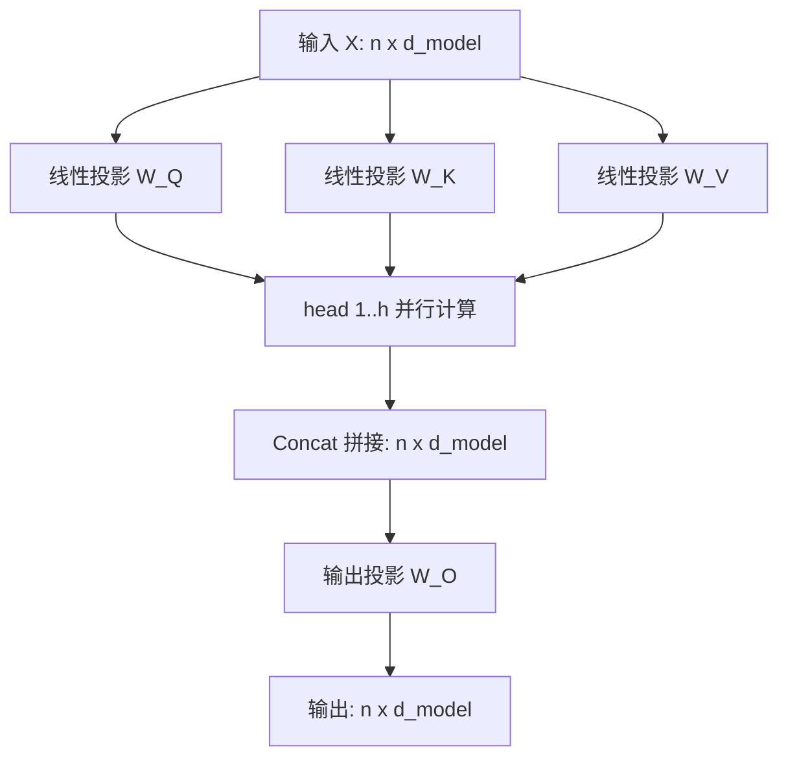

# 从自注意力到 Transformer 的完整计算路径

Self-Attention 是 Transformer 的核心算子。本文按张量形状与公式推导完整计算路径，并解释每个设计选择要解决的失效模式。

## 从加权平均说起

注意力本质是一次**由查询动态决定的加权平均**：输出是各位置值的加权和，权重由查询与键的相似度决定。


## 缩放点积注意力

给定查询矩阵 $Q \in \mathbb{R}^{n \times d_k}$、键矩阵 $K \in \mathbb{R}^{m \times d_k}$、值矩阵 $V \in \mathbb{R}^{m \times d_v}$：

$$
\text{Attention}(Q, K, V) = \text{softmax}\left(\frac{QK^\top}{\sqrt{d_k}}\right)V
$$

输出形状为 $n \times d_v$，行数只由查询数量决定，与键值数量无关。

### 为什么要除以 $\sqrt{d_k}$

假设 $q$ 与 $k$ 各维独立、均值为 0、方差为 1，则点积 $q \cdot k = \sum_{i=1}^{d_k} q_i k_i$ 的方差为 $d_k$。当 $d_k$ 增大时点积量级随之增大，softmax 会被推向饱和区：

$$
\frac{\partial}{\partial z_i}\text{softmax}(z)_j = \text{softmax}(z)_j(\delta_{ij} - \text{softmax}(z)_i)
$$

饱和时权重接近 one-hot，上述梯度趋近于 0，训练停滞。除以 $\sqrt{d_k}$ 把方差重新拉回 1，这是纯数值稳定性的修正。

## 多头注意力的等价变换

多头并非提高表达能力，而是**在相同算力下提供多个独立的投影子空间**：

$$
\text{MultiHead}(Q, K, V) = \text{Concat}(\text{head}_1, \dots, \text{head}_h)W^O
$$

其中 $\text{head}_i = \text{Attention}(QW_i^Q, KW_i^K, VW_i^V)$，且 $d_k = d_{model} / h$，因此总参数量与单头相当。



## 手写一个最小实现

以下实现只依赖 PyTorch 基础算子，用于核对形状与公式是否一致：

```python
import math
import torch
import torch.nn.functional as F

def scaled_dot_product_attention(q, k, v, mask=None):
    """q, k, v: (batch, heads, seq, dim)"""
    d_k = q.size(-1)
    # (B, H, n, m)
    scores = torch.matmul(q, k.transpose(-2, -1)) / math.sqrt(d_k)
    if mask is not None:
        scores = scores.masked_fill(mask == 0, float("-inf"))
    weights = F.softmax(scores, dim=-1)
    # 返回注意力权重，便于检查是否出现 one-hot 饱和
    return torch.matmul(weights, v), weights

B, H, N, D = 2, 4, 6, 8
q = torch.randn(B, H, N, D)
out, w = scaled_dot_product_attention(q, q, q)
# 形状应为 (2, 4, 6, 8)，权重每行和为 1
assert out.shape == (B, H, N, D)
assert torch.allclose(w.sum(-1), torch.ones(B, H, N), atol=1e-5)
print("ok", out.shape)
```

::: tip 自注意力与交叉注意力的差别
自注意力中 $Q$、$K$、$V$ 来自同一序列，因此权重矩阵是 $n \times n$ 的方阵；交叉注意力中 $Q$ 来自解码器、$K$ 与 $V$ 来自编码器，权重矩阵为 $n_{dec} \times n_{enc}$。
:::

::: warning 常见误区
把多头理解为"多算几遍"并不准确。若不加输出投影 $W^O$，多头拼接后各子空间无法融合，等价性会退化；$W^O$ 是把多个子空间映射回统一表示的必要环节。
:::

## 更新日志

| 日期 | 说明 |
| --- | --- |
| 2026-10-07 | 初稿：缩放点积注意力、多头的等价变换、最小 PyTorch 实现 |
